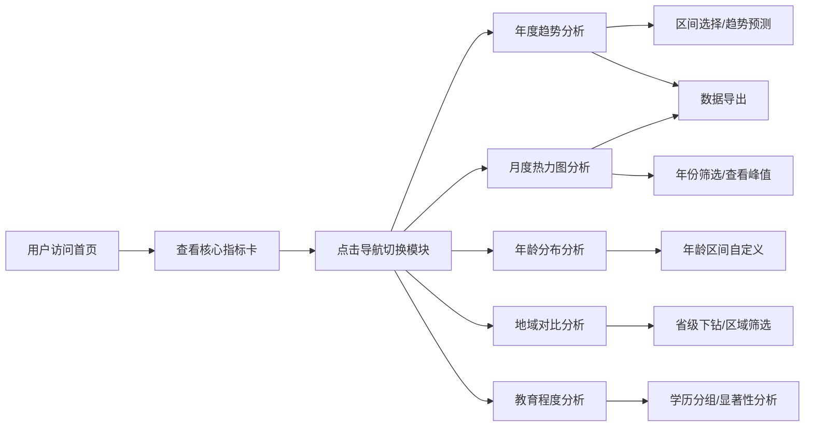

## 1. 产品概述

婚姻状况数据分析可视化面板是一个面向政府统计部门、社会学研究机构及公众的数据可视化平台。通过对结婚登记、离婚登记、结婚率、离婚率等核心指标的多维度展示，帮助用户直观了解婚姻状况的变化趋势、地域差异、年龄结构和教育程度影响。

- 核心目标：提供直观、专业、交互丰富的婚姻数据可视化分析工具
- 目标用户：政府统计人员、社会学研究者、政策制定者、普通公众
- 市场价值：为婚姻政策制定、社会研究提供数据支撑和决策参考

## 2. 核心功能

### 2.1 用户角色
| 角色 | 注册方式 | 核心权限 |
|------|----------|----------|
| 普通用户 | 无需注册 | 浏览所有数据可视化模块、使用筛选和交互功能、导出数据 |

### 2.2 功能模块
1. **首页核心指标卡**：年度结婚/离婚总数、结婚率/离婚率、同比变化百分比
2. **年度趋势分析**：近10年双线折线图、政策节点标注、区间选择、趋势预测、数据导出
3. **月度热力图分析**：结婚/离婚季节性热力图、高峰期标注、按年份筛选
4. **年龄分布分析**：分性别初婚年龄直方图、30-34岁趋势高亮、年龄区间自定义
5. **地域对比分析**：全国→省市区下钻、柱状图对比、平均值参考线、多维度筛选
6. **教育程度分析**：按学历离婚率对比、相关性分析、显著性检验

### 2.3 页面详情
| 页面名称 | 模块名称 | 功能描述 |
|----------|----------|----------|
| 首页/仪表盘 | 导航栏 | 顶部导航、Logo、页面切换Tab |
| 首页/仪表盘 | 核心指标卡 | 4个核心指标卡片，展示数值、同比变化、趋势箭头 |
| 年度趋势页面 | 双线折线图 | 结婚率/离婚率近10年趋势、政策节点标注 |
| 年度趋势页面 | 工具栏 | 区间选择器、趋势预测开关、数据导出按钮 |
| 月度热力图页面 | 热力图组件 | 12月×31天热力矩阵、特殊日期高亮、年份选择器 |
| 月度热力图页面 | 图例说明 | 颜色梯度说明、高峰期图例 |
| 年龄分布页面 | 直方图组件 | 男性/女性初婚年龄分布、双峰特征展示 |
| 年龄分布页面 | 对比工具 | 年龄区间选择、多年份对比功能 |
| 地域对比页面 | 地图/柱状图 | 省级数据下钻、结婚率/离婚率对比、平均值线 |
| 地域对比页面 | 筛选面板 | 区域筛选、人口规模筛选 |
| 教育程度页面 | 分组柱状图 | 各学历离婚率对比、误差线显示 |
| 教育程度页面 | 相关性分析 | 教育程度与婚姻稳定性关联展示 |

## 3. 核心流程

用户进入首页后，首先看到核心指标卡概览，然后通过顶部导航切换到不同分析模块。每个模块支持筛选、下钻、导出等交互操作。

## 4. 用户界面设计

### 4.1 设计风格
- **主色调**：深蓝靛色系（#1e3a5f），代表专业、稳重、数据感
- **辅助色**：珊瑚橙（#ff6b6b）用于上升/积极，薄荷绿（#51cf66）用于下降/消极
- **中性色**：深灰（#2d3748）文字、中灰（#718096）次要文字、浅灰（#e2e8f0）分隔线、背景灰（#f7fafc）
- **卡片风格**：圆角8px、轻微阴影、白色背景、悬停时阴影加深
- **字体**：中文使用 "PingFang SC" / "Microsoft YaHei"，数字使用 "Roboto Mono" 等宽字体
- **布局风格**：卡片式网格布局，顶部导航 + 内容区双层结构
- **图标风格**：线性图标（Lucide），简约现代

### 4.2 页面设计概览
| 页面名称 | 模块名称 | UI元素 |
|----------|----------|--------|
| 首页 | 导航栏 | 深色背景、白色文字、活动态下划线指示 |
| 首页 | 指标卡 | 大数字展示、同比百分比标签（带箭头）、渐变装饰条 |
| 年度趋势页 | 折线图 | 双线配色、数据点标注、政策节点竖线标记 |
| 月度热力图 | 热力矩阵 | 渐变色块、特殊日期圆点标记、月份标签 |
| 年龄分布页 | 直方图 | 男性蓝色、女性粉色分组、峰值高亮 |
| 地域对比页 | 柱状图 | 水平/垂直柱状图、平均值虚线、可点击下钻 |
| 教育程度页 | 对比图 | 分组柱状图、显著性标记、相关系数展示 |

### 4.3 响应式设计
- 桌面端优先设计（1200px+）
- 平板端（768-1200px）：卡片自适应换行，图表缩放
- 移动端（<768px）：单列布局，图表改为滚动查看，简化交互
- 触控优化：按钮最小44px，图表触控区域放大

### 4.4 数据可视化风格
- 图表配色统一遵循设计系统
- 动画：数据加载时渐入、切换时平滑过渡
- 交互：悬停显示详细数据、点击触发下钻或详情
- 导出：支持PNG图片和CSV数据两种导出格式
