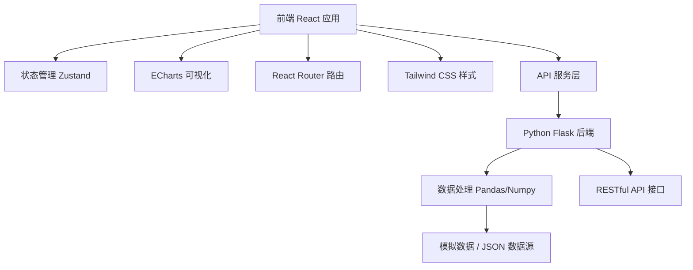
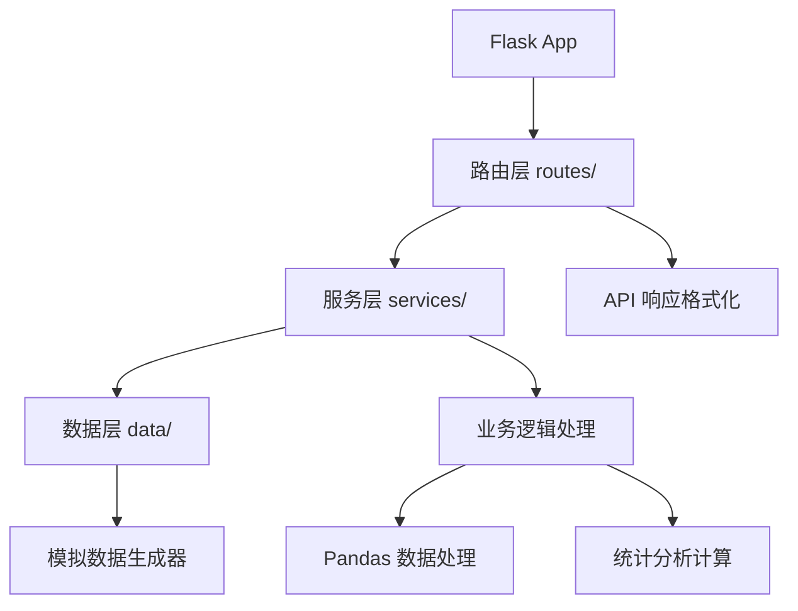

## 1. 架构设计



## 2. 技术栈描述

### 2.1 前端技术栈
- **框架**：React 18 + TypeScript
- **构建工具**：Vite 5
- **路由**：React Router DOM 6
- **状态管理**：Zustand 4
- **样式方案**：Tailwind CSS 3
- **UI组件**：自定义组件库 + Lucide React 图标
- **可视化库**：ECharts 5 + echarts-for-react
- **数据请求**：Axios
- **开发语言**：TypeScript 5

### 2.2 后端技术栈
- **框架**：Flask 3.0 + Flask-CORS
- **数据处理**：Pandas、NumPy
- **API 风格**：RESTful API
- **数据格式**：JSON
- **数据源**：模拟数据（基于真实统计数据生成）

### 2.3 开发与构建
- **包管理器**：npm（前端）/ pip（后端）
- **代码规范**：ESLint + Prettier
- **类型检查**：TypeScript 严格模式

## 3. 路由定义

| 路由路径 | 页面名称 | 描述 |
|----------|----------|------|
| / | 首页/仪表盘 | 核心指标卡展示，数据概览 |
| /trend | 年度趋势分析 | 近10年结婚率离婚率趋势图 |
| /heatmap | 月度热力图 | 结婚/离婚月度分布热力图 |
| /age | 年龄分布 | 初婚年龄分性别分布直方图 |
| /region | 地域对比 | 各省市结婚率离婚率对比分析 |
| /education | 教育程度 | 学历与婚姻稳定性关联分析 |

## 4. API 接口定义

### 4.1 数据类型定义
```typescript
// 核心指标数据
interface CoreMetrics {
  year: number;
  marriageCount: number;        // 结婚登记数（万对）
  divorceCount: number;         // 离婚登记数（万对）
  marriageRate: number;         // 结婚率（‰）
  divorceRate: number;          // 离婚率（‰）
  marriageYoY: number;          // 结婚同比变化（%）
  divorceYoY: number;           // 离婚同比变化（%）
  marriageRateYoY: number;      // 结婚率同比变化（%）
  divorceRateYoY: number;       // 离婚率同比变化（%）
}

// 年度趋势数据
interface AnnualTrend {
  year: number;
  marriageRate: number;
  divorceRate: number;
  marriageCount: number;
  divorceCount: number;
}

// 政策节点
interface PolicyNode {
  year: number;
  month?: number;
  name: string;
  description: string;
}

// 月度热力图数据
interface HeatmapData {
  year: number;
  month: number;    // 1-12
  day: number;      // 1-31
  marriageCount: number;
  divorceCount: number;
  isPeak: boolean;  // 是否高峰期
  peakType?: string; // 高峰期类型
}

// 年龄分布数据
interface AgeDistribution {
  year: number;
  gender: 'male' | 'female';
  ageGroups: {
    ageRange: string;    // "20-24", "25-29", ...
    count: number;       // 登记人数
    percentage: number;  // 占比
  }[];
  averageAge: number;    // 平均初婚年龄
}

// 地域数据
interface RegionData {
  code: string;
  name: string;
  level: 'country' | 'province' | 'city';
  marriageRate: number;
  divorceRate: number;
  marriageCount: number;
  divorceCount: number;
  population: number;
  region: 'east' | 'central' | 'west' | 'northeast';
  children?: RegionData[];
}

// 教育程度数据
interface EducationData {
  year: number;
  educationLevel: string;  // 小学, 初中, 高中, 大专, 本科, 硕士, 博士
  marriageCount: number;
  divorceCount: number;
  divorceRate: number;     // 离婚率
  sampleSize: number;      // 样本量
  significance?: number;   // 显著性水平
}
```

### 4.2 API 列表

| 接口路径 | 方法 | 描述 | 返回类型 |
|----------|------|------|----------|
| /api/metrics | GET | 获取核心指标数据 | CoreMetrics |
| /api/trend | GET | 获取年度趋势数据（支持年份范围） | AnnualTrend[] |
| /api/policies | GET | 获取政策节点列表 | PolicyNode[] |
| /api/heatmap/marriage | GET | 获取结婚热力图数据（按年份） | HeatmapData[] |
| /api/heatmap/divorce | GET | 获取离婚热力图数据（按年份） | HeatmapData[] |
| /api/age-distribution | GET | 获取年龄分布数据（按年份、性别） | AgeDistribution |
| /api/regions | GET | 获取地域数据（支持层级、区域筛选） | RegionData[] |
| /api/regions/:code | GET | 获取指定地区详情及子级数据 | RegionData |
| /api/education | GET | 获取教育程度数据 | EducationData[] |
| /api/education/correlation | GET | 获取教育程度相关性分析结果 | { correlation: number; pValue: number } |

### 4.3 请求参数
- 年份筛选：`year=2024` 或 `startYear=2015&endYear=2024`
- 地区筛选：`region=east,central`
- 人口规模：`population=large,medium,small`
- 数据格式：`format=json`

## 5. 后端架构图



## 6. 项目目录结构

```
label-133/
├── .trae/
│   └── documents/           # 项目文档
├── frontend/                # 前端项目
│   ├── src/
│   │   ├── components/      # 可复用组件
│   │   │   ├── charts/      # ECharts 图表组件
│   │   │   ├── layout/      # 布局组件
│   │   │   └── common/      # 通用组件
│   │   ├── pages/           # 页面组件
│   │   ├── hooks/           # 自定义 Hooks
│   │   ├── store/           # Zustand 状态管理
│   │   ├── services/        # API 服务层
│   │   ├── utils/           # 工具函数
│   │   ├── types/           # TypeScript 类型定义
│   │   ├── App.tsx
│   │   └── main.tsx
│   ├── public/
│   ├── package.json
│   ├── tsconfig.json
│   ├── vite.config.ts
│   └── tailwind.config.js
└── backend/                 # 后端项目
    ├── app.py               # Flask 应用入口
    ├── routes/              # 路由模块
    ├── services/            # 业务服务
    ├── data/                # 数据生成与处理
    ├── requirements.txt     # Python 依赖
    └── config.py            # 配置文件
```

## 7. 前端核心组件规划

| 组件名称 | 路径 | 职责 |
|----------|------|------|
| Navbar | components/layout/Navbar | 顶部导航栏 |
| MetricCard | components/common/MetricCard | 核心指标卡片 |
| TrendChart | components/charts/TrendChart | 年度趋势折线图 |
| HeatmapChart | components/charts/HeatmapChart | 月度热力图 |
| AgeHistogram | components/charts/AgeHistogram | 年龄分布直方图 |
| RegionBarChart | components/charts/RegionBarChart | 地域对比柱状图 |
| EducationChart | components/charts/EducationChart | 教育程度对比图 |
| FilterPanel | components/common/FilterPanel | 通用筛选面板 |
| DataExport | components/common/DataExport | 数据导出组件 |
